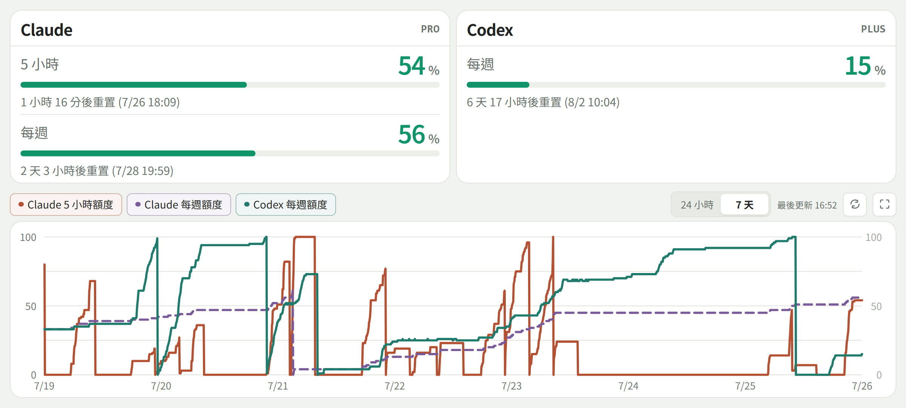

# Token Monitor

監控 **Claude**（Desktop / 網頁 / Claude Code 共用額度）與 **Codex**（ChatGPT 訂閱額度）的
5 小時視窗與每週視窗使用率，提供手機可看的網頁儀表板。

額度是帳號層級共用的，所以就算主要用桌面版 App，這裡顯示的數字就是你實際的剩餘額度。



## 登入需求

- Claude：必須先安裝 Claude Code CLI 並完成登入。Token Monitor 目前只讀取 Claude Code
  的 OAuth 憑證（Claude Desktop 的憑證讀取較複雜，目前未支援）。查到的是帳號共用額度，因此仍包含
  Claude Desktop、網頁版與 Claude Code 的使用量，但無法區分各來源。
- Codex：Codex Desktop App 或 Codex CLI 任一端完成登入即可，兩者共用
  `~/.codex/auth.json`。查到的同樣是帳號共用額度，無法區分 Desktop 與 CLI 的使用量。

## 啟動

```sh
python server.py
```

- 本機打開 <http://localhost:8787>
- 手機（同一個 Wi-Fi）打開 `http://<這台電腦的區網 IP>:8787`，啟動時終端機會印出網址

## macOS 狀態列

macOS 可以直接跑狀態列版本（需要 uv，會自動安裝 `rumps` 等依賴）：

```sh
uv run menu_bar.py
```

狀態列會顯示 Claude / Codex 的 5 小時視窗用量，例如 `C 42% X 18%`。
點開選單可以查看 5 小時與每週視窗、手動刷新。狀態列版本會重用同一套本機憑證讀取與 token refresh 邏輯，
不會把 token 顯示在選單或 HTTP 回應裡。

## PWA（加入主畫面）

已內建 Web App Manifest、圖示與 service worker：

- iOS Safari：分享 →「加入主畫面」，會有獨立圖示、全螢幕開啟（無網址列）。HTTP 即可。
- Android Chrome：選單 →「加入主畫面」。純 HTTP 只會建一般書籤，開起來仍是帶網址列的瀏覽器分頁；
  若要安裝為真正的 standalone PWA，需要 HTTPS（見下方 [HTTPS 段落](#httpsca)）。

> **Note**:
> Android 瀏覽器可以直接使用全螢幕模式，不一定需要安裝 PWA。

## 開機自動啟動

**macOS（launchd）**

建立 `~/Library/LaunchAgents/com.yourname.token-monitor.plist`，內容如下（替換 `/path/to/` 為實際路徑）：

```xml
<?xml version="1.0" encoding="UTF-8"?>
<!DOCTYPE plist PUBLIC "-//Apple//DTD PLIST 1.0//EN" "http://www.apple.com/DTDs/PropertyList-1.0.dtd">
<plist version="1.0">
<dict>
  <key>Label</key>
  <string>com.yourname.token-monitor</string>
  <key>ProgramArguments</key>
  <array>
    <string>/path/to/uv</string>
    <string>run</string>
    <string>server.py</string>
  </array>
  <key>WorkingDirectory</key>
  <string>/path/to/token-monitor</string>
  <key>RunAtLoad</key>
  <true/>
  <key>KeepAlive</key>
  <true/>
  <key>StandardOutPath</key>
  <string>/path/to/token-monitor/data/server.log</string>
  <key>StandardErrorPath</key>
  <string>/path/to/token-monitor/data/server.log</string>
</dict>
</plist>
```

`uv` 路徑可用 `which uv` 查到。

```sh
launchctl load ~/Library/LaunchAgents/com.yourname.token-monitor.plist
```

停用：

```sh
launchctl unload ~/Library/LaunchAgents/com.yourname.token-monitor.plist
```

狀態列版本的 plist 格式相同，將 `server.py` 改為 `menu_bar.py`、Log 路徑改為 `menubar.log` 即可。

**Windows（工作排程器）**

用系統管理員身分開 PowerShell：

```powershell
schtasks /create /tn "TokenMonitor" /tr "C:\path\to\token-monitor\start-windows.bat" /sc onlogon /rl highest
```

移除：

```powershell
schtasks /delete /tn "TokenMonitor" /f
```

## 本機 API

二次開發或串接其他工具可直接打這兩個端點：

### `GET /api/usage`

回傳目前快取的用量快照。加上 `?fresh=1` 會強制重新抓取（受 60 秒冷卻限制）。

```json
{
  "claude": {
    "ok": true,
    "plan": "claude_max_20x",
    "windows": [
      {"id": "5h",     "label": "5 小時", "used_percent": 42.0, "resets_at": 1753560000},
      {"id": "weekly", "label": "每週",   "used_percent": 18.3, "resets_at": 1753992000}
    ]
  },
  "codex": {
    "ok": true,
    "windows": [
      {"id": "5h",     "label": "5 小時", "used_percent": 5.0,  "resets_at": 1753560000},
      {"id": "weekly", "label": "每週",   "used_percent": 11.2, "resets_at": 1753992000}
    ]
  },
  "updated_at": 1753556400
}
```

`ok: false` 時會有 `error` 欄位說明原因（找不到憑證、網路錯誤等）。`resets_at` 是 Unix timestamp，視 API 回應而定，可能為 `null`。

### `GET /api/history?hours=24`

回傳指定時數內的歷史記錄，預設 24 小時，最長 30 天（720 小時）。

```json
{
  "claude:5h":     [[1753550000, 38.0], [1753553000, 41.5], ...],
  "claude:weekly": [[1753550000, 17.1], [1753553000, 18.3], ...],
  "codex:5h":      [[1753550000,  4.8], ...],
  "codex:weekly":  [[1753550000, 11.0], ...]
}
```

每筆格式為 `[timestamp, used_percent]`，依時間順序排列。

## 資料來源

| 來源 | 憑證位置 | 端點 |
|---|---|---|
| Claude | macOS：Keychain 的 `Claude Code-credentials`；Windows / Linux：`~/.claude/.credentials.json`（Windows 另相容舊版 Credential Manager） | `api.anthropic.com/api/oauth/usage`（非公開端點，即 Claude Code `/usage` 指令的資料來源） |
| Codex | `~/.codex/auth.json`（三平台格式一致，Windows 為 `%USERPROFILE%\.codex\auth.json`） | `chatgpt.com/backend-api/wham/usage`（Codex `/status` 的資料來源） |

### 為什麼不用 hook？

Claude Code 與 Codex CLI 都有 hook 機制，可以在每次 tool call 前後觸發腳本。但 hook 只在 CLI 執行中才會觸發，不跑 CLI 的時候就沒有資料，也抓不到 Claude Desktop、網頁版的用量。這個專案的目的是顯示帳號共用的真實剩餘額度，任何時候打開都要能看到，所以選擇直接打用量 API。

### Windows 注意事項

Windows Credential Manager 裡 Claude Code 憑證的 **target name** 沒有實機驗證過，程式預設依序嘗試
`Claude Code-credentials`、`Claude Code`。如果讀不到，打開「認證管理員」(Credential Manager)→
「Windows 認證」，找到 Claude 相關的項目，把正確名稱設定成環境變數再啟動：

```powershell
$env:TOKEN_MONITOR_CLAUDE_CRED_TARGET = "實際看到的名稱"
python server.py
```

Token 過期時會自動用 refresh token 換新，並寫回原本的儲存位置（Keychain / auth.json），
與官方工具的行為一致。Token 不會出現在日誌、瀏覽器或任何 HTTP 回應中。

## 注意事項

- 兩個用量端點都是**非官方文件化**的端點，格式可能隨官方改版而變；`server.py`
  對 Claude 的回應解析有新舊兩套 schema 的備援。
- 背景每 5 分鐘輪詢一次（社群經驗 180 秒以上是安全頻率），手動「刷新」最短間隔 60 秒。
- 歷史資料存在 `data/history.db`（SQLite），趨勢圖會隨時間累積。
- 若 Claude 憑證徹底失效（refresh token 也過期），開一次 Claude Code 重新登入即可。

## HTTPS（自簽 CA）

只有想在 **Android 上安裝 standalone PWA** 才需要這段。一般使用不需要設定。

Service worker 與 Android PWA 安裝都要求 secure context。內建自簽 CA 方案，
不需要反向代理——`http.server` 直接由 Python `ssl` 模組包成 HTTPS：

```sh
uv run gen_certs.py   # 產生 certs/ca.pem（CA）與 certs/server.pem（伺服器憑證）
uv run server.py      # 偵測到 certs/ 會自動加開 HTTPS（預設 8788 埠）
```

手機安裝 CA 憑證（一次性）：

1. 手機瀏覽器開 `http://<區網 IP>:8787/ca.pem` 下載
2. **iOS：**設定 → 一般 → VPN 與裝置管理 → 安裝描述檔，再到
   一般 → 關於本機 → 憑證信任設定 → 開啟完全信任
3. **Android：**設定 → 安全性 → 加密與憑證 → 安裝憑證 → CA 憑證
4. 之後手機一律開 `https://<區網 IP>:8788`，再「加入主畫面」

備註：伺服器憑證 SAN 綁目前的區網 IP；**IP 變了重跑 `gen_certs.py` 再重啟即可**，
CA 不變、手機不用重裝。建議在路由器上幫 Mac 設固定 IP 免去這個麻煩。
